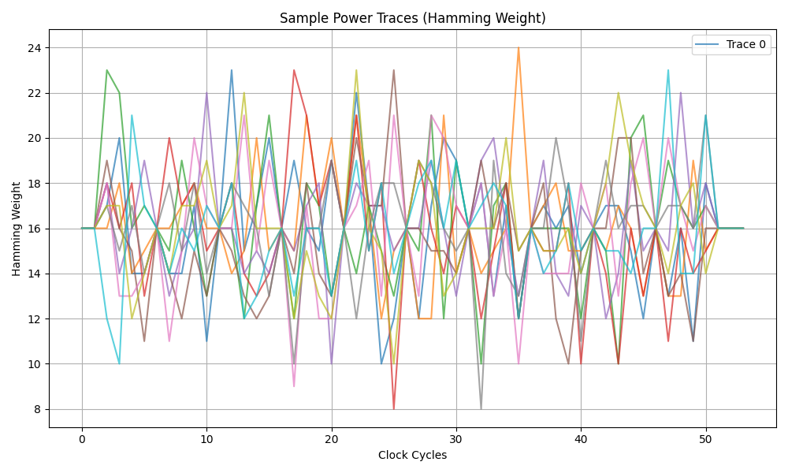
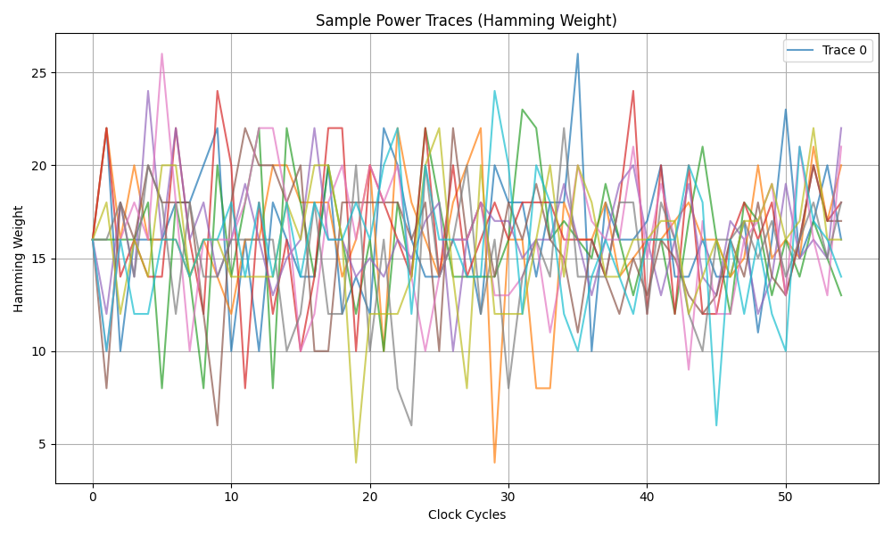
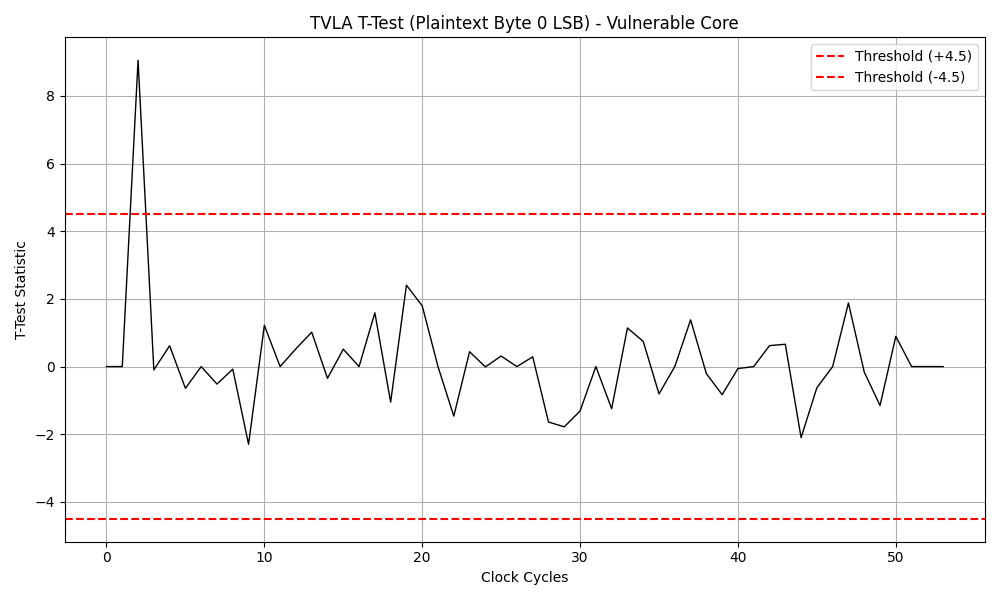
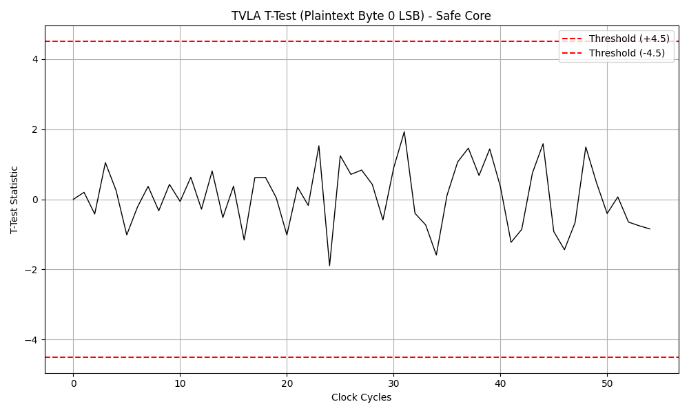
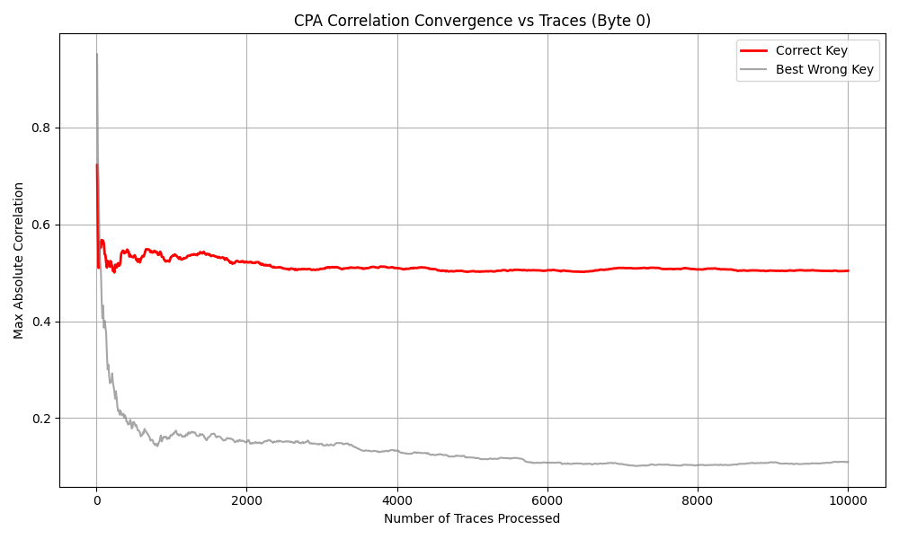
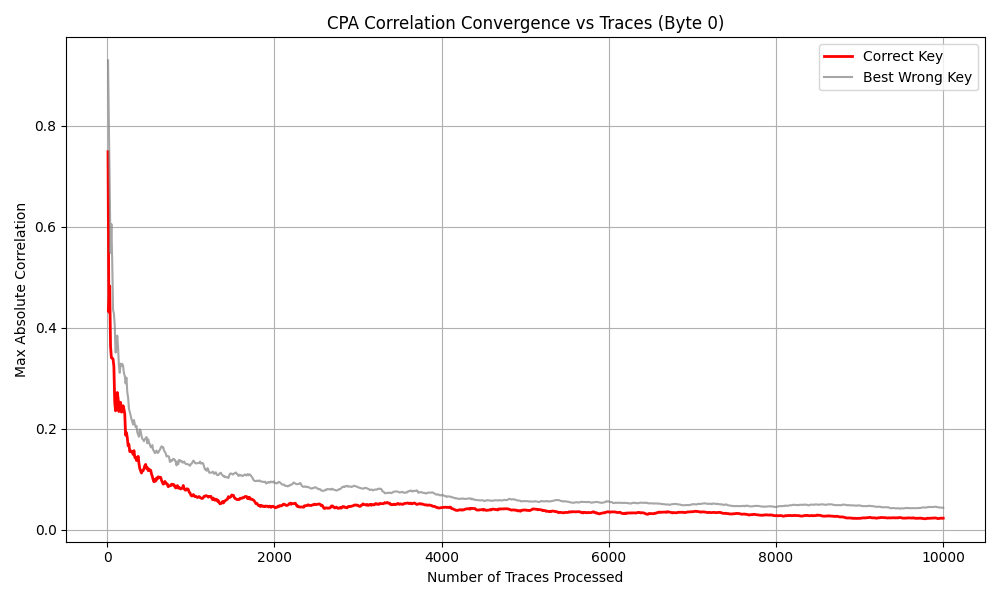
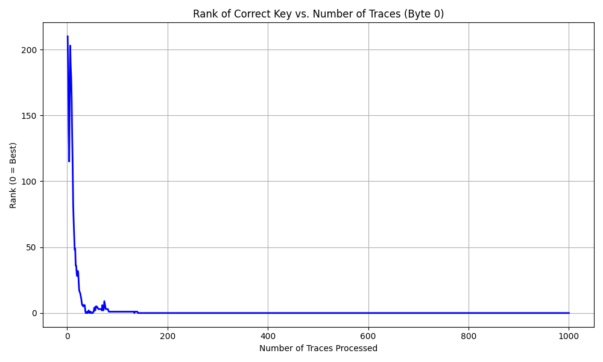
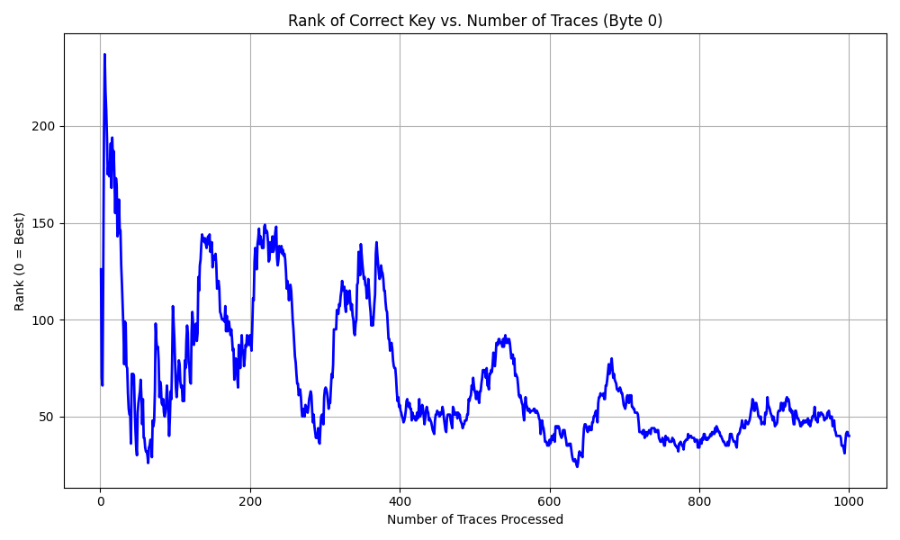

# AES-128 Side-Channel Attack Research Project

A complete, end-to-end hardware security research workflow demonstrating how an unprotected RTL implementation of AES-128 is vulnerable to Side-Channel Attacks (SCA), how to formally verify that vulnerability, and how hardware countermeasures eradicate it. The project uses Verilog simulation to generate synthetic power traces and attempts key recovery using both **Correlation Power Analysis (CPA)** and **Machine Learning (Multi-Layer Perceptrons / MLP)**.

---

## Table of Contents

1. [Background: What is AES-128?](#1-background-what-is-aes-128)
   - 1.1 [Why AES?](#11-why-aes)
   - 1.2 [AES Algorithm Structure](#12-aes-algorithm-structure)
   - 1.3 [The Key Schedule](#13-the-key-schedule)
   - 1.4 [Mathematical Security — and Why It Is Not Enough](#14-mathematical-security--and-why-it-is-not-enough)
2. [Background: Side-Channel Power Analysis](#2-background-side-channel-power-analysis)
   - 2.1 [What is a Side-Channel Attack?](#21-what-is-a-side-channel-attack)
   - 2.2 [Why Power Consumption Leaks Secrets](#22-why-power-consumption-leaks-secrets)
   - 2.3 [The Hamming Weight Power Model](#23-the-hamming-weight-power-model)
   - 2.4 [Simple vs. Differential vs. Correlation Power Analysis](#24-simple-vs-differential-vs-correlation-power-analysis)
3. [Hardware Verification Stage: Why Simulate?](#3-hardware-verification-stage-why-simulate)
   - 3.1 [RTL-Level Security Verification](#31-rtl-level-security-verification)
   - 3.2 [TVLA — Formal Leakage Assessment](#32-tvla--formal-leakage-assessment)
   - 3.3 [Simulation vs. Silicon](#33-simulation-vs-silicon)
4. [The Two Attack Methods](#4-the-two-attack-methods)
   - 4.1 [Classical CPA (Kocher et al., 1998)](#41-classical-cpa-kocher-et-al-1998)
   - 4.2 [Deep Learning / MLP Attack](#42-deep-learning--mlp-attack)
5. [Hardware Implementations](#5-hardware-implementations)
   - 5.1 [The Vulnerable Core (AES_128/)](#51-the-vulnerable-core-aes_128)
   - 5.2 [The Secure Core (AES_128_safe/)](#52-the-secure-core-aes_128_safe)
   - 5.3 [Cycle-by-Cycle Execution Analysis](#53-cycle-by-cycle-execution-analysis)
6. [Experimental Results](#6-experimental-results)
7. [Project Structure](#7-project-structure)
8. [Dependencies & Environment Setup](#8-dependencies--environment-setup)
9. [How to Run — Step by Step](#9-how-to-run--step-by-step)
   - 9.1 [Attacking the Vulnerable Core](#91-attacking-the-vulnerable-core)
   - 9.2 [Verifying the Secure Core](#92-verifying-the-secure-core)
10. [Script Reference](#10-script-reference)
11. [Understanding the Outputs](#11-understanding-the-outputs)

---

## 1. Background: What is AES-128?

### 1.1 Why AES?

**AES (Advanced Encryption Standard)**, standardized by NIST in 2001 (FIPS PUB 197), is the dominant symmetric-key block cipher in use today. It encrypts data in 128-bit blocks using a 128-, 192-, or 256-bit key. The 128-bit variant (AES-128) has a key space of 2^128 ≈ 3.4 × 10^38 — so large that even if every atom in the observable universe were a computer checking one billion keys per second, it would still take longer than the age of the universe to brute-force.

AES is used in:
- TLS/HTTPS (securing all web traffic)
- Disk encryption (BitLocker, FileVault, LUKS)
- Wi-Fi (WPA2/WPA3)
- Embedded hardware security modules (HSMs) and smart cards
- Hardware crypto accelerators in CPUs (AES-NI instructions)

The algorithm was selected after a 5-year open competition (the AES contest, 1997-2001). All submitted candidates were analyzed for mathematical weaknesses, and **Rijndael** (by Joan Daemen and Vincent Rijmen) was selected for its security, efficiency, and elegance. No practical mathematical attack on full AES-128 has ever been published.

### 1.2 AES Algorithm Structure

AES-128 transforms a 128-bit plaintext into a 128-bit ciphertext by applying **10 rounds** of four operations to a 4×4 matrix of bytes called the **State**:

```
Plaintext (128 bits)
        |
        v
[ Initial AddRoundKey ]  — XOR with the full 128-bit key
        |
  Round 1 through 9:
        |
        +---> [ SubBytes   ]  — Non-linear substitution via the S-Box
        +---> [ ShiftRows  ]  — Byte-level row rotation
        +---> [ MixColumns ]  — Column mixing over GF(2^8)
        +---> [ AddRoundKey]  — XOR with the round key
        |
  Round 10 (final, no MixColumns):
        |
        +---> [ SubBytes   ]
        +---> [ ShiftRows  ]
        +---> [ AddRoundKey]
        |
        v
Ciphertext (128 bits)
```

**SubBytes** is the only non-linear step. It replaces each byte of the State with a pre-computed 256-entry lookup table (the S-Box, derived from the multiplicative inverse in GF(2^8) followed by an affine transformation). SubBytes is what makes AES resistant to linear and differential cryptanalysis — but it is also the primary attack target for side-channel attacks, because its output depends on both the plaintext and the key, and its non-linearity creates large Hamming Weight variance that is observable in power consumption.

**MixColumns** operates on each 4-byte column as a polynomial over GF(2^8). Together with ShiftRows, it provides **diffusion** — each output bit depends on every input bit after 2 rounds. This is described by the AES designers as the "wide trail strategy."

### 1.3 The Key Schedule

AES-128 derives 11 round keys (one for the initial AddRoundKey and one for each of the 10 rounds) from the original 128-bit master key via the **Key Schedule**. This expansion is fully deterministic and reversible: recovering any single round key is equivalent to recovering the master key. In this project, the key schedule runs once before encryption begins and is implemented in `aes_key_mem.v`.

The fixed key used in all experiments is the **NIST FIPS-197 Appendix B** test vector:

```
Key:       2b 7e 15 16 28 ae d2 a6 ab f7 15 88 09 cf 4f 3c
Plaintext: 32 43 f6 a8 88 5a 30 8d 31 31 98 a2 e0 37 07 34
Expected:  39 25 84 1d 02 dc 09 fb dc 11 85 97 19 6a 0b 32
```

The testbench verifies this vector before starting the 10,000-trace collection loop.

### 1.4 Mathematical Security — and Why It Is Not Enough

The mathematical security of AES is essentially certain. The best known theoretical attack (biclique cryptanalysis) reduces the effective key space from 2^128 to 2^126.1 — a negligible improvement that is completely impractical. AES will not be broken mathematically in any foreseeable future.

However, a chip implementing AES is a physical object. Its transistors switch, consume current, emit electromagnetic radiation, and take measurable time to complete operations. **Every one of these physical observables can, in principle, leak information about the secret key being processed.** The cryptographic algorithm is provably secure; the hardware implementation may not be.

This is the core problem studied in this project.

---

## 2. Background: Side-Channel Power Analysis

### 2.1 What is a Side-Channel Attack?

A **side-channel** is any measurable physical property of a cryptographic device that is correlated with its internal computations — and therefore with the secret data being processed. Common side channels include:

| Side Channel | What is Measured |
|---|---|
| **Power Analysis** | Current drawn from the power supply over time |
| **Electromagnetic (EM)** | Electromagnetic field radiated by on-chip current loops |
| **Timing** | Execution time of operations (cache misses, branch prediction) |
| **Acoustic** | Sound emitted by vibrating capacitors (coil whine) |
| **Fault Injection** | Behavior change under power glitches, laser pulses, or clock glitches |

This project focuses on **power analysis**, the most widely studied side channel, because it requires only a low-cost current probe or shunt resistor on the power supply line ("oscilloscope at the capacitor").

### 2.2 Why Power Consumption Leaks Secrets

Modern digital chips are built from **CMOS (Complementary Metal-Oxide-Semiconductor)** transistors. A CMOS gate draws no static current — power is consumed only when the output switches from 0→1 or 1→0, because charging/discharging the gate's load capacitance requires current to flow momentarily. The amount of power drawn in a given clock cycle is therefore proportional to:

1. **The number of bits that switch** (the Hamming Distance between the old and new bus value).
2. **The total capacitance** being driven (wire length, fanout).

If an attacker can predict the number of bits that will switch based on a hypothesis about the key, they can statistically test whether their hypothesis matches the measured power — and thereby recover the key.

### 2.3 The Hamming Weight Power Model

In simulation, we cannot model analog physics. Instead, we use the widely accepted **Hamming Weight (HW)** proxy:

```
Power(t) ≈ α · HW(Data(t)) + β + Noise
```

where:
- `HW(x)` = the number of set bits in `x` (e.g., `HW(0b01001101) = 3`)
- `α` is a proportionality constant (set to 1 in simulation)
- `β` is a constant offset (set to 0 in simulation)
- `Noise` accounts for measurement imperfections (zero in ideal simulation)

**Why this works as an attack target:** Consider the first SubBytes operation of AES:

```
S-Box_Output = SBOX( Plaintext_byte XOR Key_byte )
```

- The plaintext is **known** to the attacker (chosen-plaintext attack scenario).
- The key byte is **unknown** (the secret).
- For each of the 256 possible key byte guesses `k`, the attacker can compute `HW(SBOX[pt ^ k])`.
- The attacker measures `HW` of the actual chip output at the S-Box clock cycle.
- The correct `k` perfectly predicts `HW`; all others are uncorrelated (on average).

### 2.4 Simple vs. Differential vs. Correlation Power Analysis

| Attack | Description | Traces Needed |
|---|---|---|
| **SPA (Simple)** | Visually inspect a single trace — patterns reveal operations | 1 |
| **DPA (Differential)** | Split traces by predicted bit, compare means | Hundreds |
| **CPA (Correlation)** | Compute Pearson correlation for all 256 key guesses | ~50 (in simulation) |

**CPA** is the method implemented here. It generalizes DPA from comparing means (1 bit of information) to computing the full correlation (using HW = log2(9) ≈ 3.2 bits of information per trace). This makes CPA significantly more efficient than DPA.

---

## 3. Hardware Verification Stage: Why Simulate?

### 3.1 RTL-Level Security Verification

This project operates at the **RTL (Register-Transfer Level)** stage of the hardware design flow — the stage where engineers describe circuit behavior in Hardware Description Languages (here: Verilog) before committing to silicon. The typical ASIC/FPGA design flow is:

```
Specification → RTL (Verilog/VHDL) → Synthesis → Place & Route → Tape-Out → Silicon
                       ^
                 [THIS PROJECT]
```

Performing side-channel verification at RTL has major advantages:
- **Bugs are free to fix:** Changing RTL takes minutes or hours; re-spinning silicon costs millions of dollars and months.
- **Perfect observability:** The simulator exposes every internal signal (via VCD files), which is impossible on a real chip without destructive decapping.
- **Perfect reproducibility:** The same seed produces the same 10,000 plaintexts, enabling exact comparison between the vulnerable and secure implementations.
- **Zero noise:** Simulation power is exactly the mathematical Hamming Weight — no measurement noise, thermal drift, or coupling from other circuitry.

This zero-noise environment is intentionally the most favorable condition for an attacker. If the countermeasures work here, they will work on silicon too (where additional noise from the real analog environment only helps the defender).

### 3.2 TVLA — Formal Leakage Assessment

**Test Vector Leakage Assessment (TVLA)** is the ISO/IEC 17825 standard method for proving whether a device leaks information. Unlike CPA (which targets a specific key), TVLA is **key-agnostic** — it answers the binary question: *"Does this device's power consumption depend on the data it processes?"* without needing to know the key.

**Method (Welch's T-Test):**
1. Collect power traces for two sets of inputs: those where a chosen bit of the plaintext is 0 (Group A) vs. 1 (Group B).
2. At every time sample `t`, compute the Welch's T-statistic:

```
        mean_A(t) - mean_B(t)
t(t) = ─────────────────────────────────────────────
        sqrt( var_A(t)/N_A  +  var_B(t)/N_B )
```

3. If `|t(t)| > 4.5` at any point, the null hypothesis ("distributions are identical") is rejected with >99.999% confidence. The device leaks.

**Decision thresholds:**
- `|t| ≤ 4.5` → Pass (no significant leakage detected)
- `|t| > 4.5` → Fail (significant information leakage proven)

The Welch's T-Test is preferred over Student's T-Test here because the two trace populations may have different variances (the countermeasure adds noise to one population but not the other in the vulnerable core).

### 3.3 Simulation vs. Silicon

| Property | RTL Simulation (This Project) | Real Silicon |
|---|---|---|
| Noise | Zero | Significant (thermal, electromagnetic coupling, ADC quantization) |
| Alignment | Perfect — every trace starts at the same simulation tick | Requires synchronization, clock jitter causes misalignment |
| Observability | All internal signals visible via VCD | Only power supply or EM probe |
| Attacker advantage | Maximum | Reduced by analog imperfections |
| Cost to iterate | Free | Millions of dollars per tape-out |

Because simulation is the **strongest possible attack environment** (zero noise, perfect alignment), passing TVLA and resisting CPA/MLP attacks in simulation represents a conservative lower bound on real-world security.

---

## 4. The Two Attack Methods

### 4.1 Classical CPA (Kocher et al., 1998)

**CPA (Correlation Power Analysis)** was introduced by Paul Kocher, Joshua Jaffe, and Benjamin Jun in their 1999 paper *"Differential Power Analysis."* It remains the standard benchmark for side-channel resistance.

**Step-by-step algorithm for recovering one key byte:**

1. **Collect N traces.** Each trace `T[i]` is a vector of HW values over time. Record the corresponding plaintext byte `pt[i]` for each trace.

2. **Build the hypothesis matrix H (shape N×256).**
   For every trace `i` and every key guess candidate `k` (0 to 255):
   ```
   H[i, k] = HW( SBOX[ pt[i] XOR k ] )
   ```
   This matrix has 256 columns — one per key hypothesis.

3. **Compute the Pearson correlation matrix R (shape 256×T).**
   For each key hypothesis `k` and each time sample `t`:
   ```
   R[k, t] = Pearson( H[:, k],  Traces[:, t] )
   ```
   This is done efficiently using the incremental sum formula:
   ```
   r = (N·Σ(h·p) - Σh·Σp) / sqrt( (N·Σh² - (Σh)²) · (N·Σp² - (Σp)²) )
   ```

4. **Find the winning hypothesis.**
   ```
   k_best = argmax_k  max_t  |R[k, t]|
   ```
   The key guess with the highest absolute correlation across all time samples is the winner.

5. **Number of Traces to Disclosure (NTD).** Run the attack incrementally (adding one trace at a time) and record the first N where the correct key byte is ranked #1.

**Computational complexity:** O(N × T × 256) per key byte — efficiently parallelizable with NumPy vectorization.

### 4.2 Deep Learning / MLP Attack

Modern SCA increasingly uses neural networks, which can learn non-linear leakage functions without assuming the Hamming Weight model. The approach treats SCA as a **supervised classification problem**:

- **Input:** a power trace of shape `(T, 1)`
- **Output:** a class label representing the leakage value

**Label Engineering:** Rather than predicting the full 8-bit S-Box output (256 classes with severe class imbalance), we map each possible SubBytes output to its **Hamming Weight (HW)**. This yields 9 classes (HW = 0 through 8). This choice:
- Aligns the ML objective with the actual physical signal (HW ∝ power).
- Reduces the output space by 28× (256 → 9 classes), allowing the network to converge with far fewer traces.
- Dramatically reduces the training data required.

**MLP Architecture:**

```
Input: Trace (54, 1)
    │
    ▼
Flatten           → (54,)
    │
    ▼
BatchNormalization
    │
    ▼
Dense(128, ReLU)
    │
    ▼
BatchNormalization
    │
    ▼
Dropout(0.3)
    │
    ▼
Dense(128, ReLU)
    │
    ▼
BatchNormalization
    │
    ▼
Dropout(0.3)
    │
    ▼
Dense(9, Softmax)  → P(HW = 0), P(HW = 1), ..., P(HW = 8)
```

**Why MLP and not ResNet/CNN?** We initially experimented with residual CNN architectures using Global Average Pooling (GAP). GAP averages the feature map across the time dimension, which is optimal for translation-invariant classification tasks (like image recognition). However, in perfectly aligned simulation traces, the leakage occurs at an **exact, fixed clock cycle**. GAP destroys this temporal information. The `Flatten`-based MLP instead learns an explicit weight for every input time step, allowing it to directly identify the single leakage point.

**Key Recovery from Trained Model:**

After training, the model outputs a probability distribution over HW classes for a given trace. To recover a key byte, we accumulate **log-likelihood scores** across all attack traces:

```
Score(k) = Σ_i  log( P_model( HW( SBOX[pt_i XOR k] ) | trace_i ) )
```

The key candidate `k` with the highest accumulated score is the predicted key byte. The **rank** of the correct key among all 256 candidates is plotted vs. the number of traces used — a rank of 0 means the model's top prediction is the correct key.

---

## 5. Hardware Implementations

### 5.1 The Vulnerable Core (`AES_128/`)

Based on the open-source `secworks/aes` project (BSD 2-Clause License, author Joachim Strömbergson). Modifications for side-channel research:

- AES-256 and decryption paths removed; encrypt-only, key size hardwired to 128 bits.
- Internal signals `enc_sboxw`, `new_sboxw`, and `enc_round_nr` exposed as output ports, allowing the VCD dump to capture S-Box data without any post-processing inference.

**File structure:**

```
AES_128/
├── rtl/
│   ├── aes_sbox.v           — 256-entry byte lookup table (S-Box), combinational
│   ├── aes_key_mem.v        — Key schedule: generates 11 round keys from master key
│   ├── aes_encipher_block.v — 10-round encryption FSM
│   └── aes_core.v           — Top-level wrapper, clocking, valid/ready handshake
└── tb/
    └── aes_tb.v             — Testbench: 10,000 encryptions, VCD + CSV output
```

**`aes_core.v` FSM:**

```
CTRL_IDLE  → (next & ready) →  CTRL_INIT  (key schedule)
CTRL_INIT  → (key ready)    →  CTRL_NEXT  (encryption)
CTRL_NEXT  → (enc ready)    →  CTRL_IDLE  (assert ready, output ciphertext)
```

**`aes_encipher_block.v` FSM:**

```
CTRL_IDLE   → CTRL_INIT   (AddRoundKey with round key 0)
CTRL_INIT   → CTRL_SBOX   (start S-Box pass 0)
CTRL_SBOX   (4 cycles, one 32-bit word per cycle: processes new_sboxw)
            → CTRL_MAIN   (ShiftRows, MixColumns, AddRoundKey)
            → CTRL_SBOX   (loop for all 10 rounds)
            → CTRL_FINAL  (last round: no MixColumns)
            → done signal asserted
```

The S-Box is 8-bit combinational. The 128-bit State is processed as four 32-bit words per round, requiring 4 consecutive S-Box cycles. On each cycle, `new_sboxw[31:0]` holds 4 fresh S-Box bytes — 32 bits of data that directly encodes key-dependent information as its Hamming Weight.

**Testbench (`aes_tb.v`) details:**

- Fixed key: `128'h2b7e151628aed2a6abf7158809cf4f3c` (NIST FIPS-197 Appendix B key vector)
- Plaintext generation: 64-bit LFSR with seed `64'hdeadbeef_cafebabe`, polynomial `p(x) = x^64+x^63+x^61+x^60+1`. The seed is fixed for 100% reproducibility.
- Outputs:
  - `data/aes_sim.vcd` — Value Change Dump of all signals across all 10,000 encryptions
  - `data/pt_ct.csv` — CSV with columns `pt_hex, ct_hex` for all 10,000 plaintext/ciphertext pairs
- The NIST test vector is verified before the main loop, and VCD capture begins only after verification to keep trace indices aligned with CSV row indices.

### 5.2 The Secure Core (`AES_128_safe/`)

Identical structure to the vulnerable core. **All changes are confined to `AES_128_safe/rtl/aes_encipher_block.v`**. The `aes_sbox.v`, `aes_key_mem.v`, and `aes_core.v` files are unchanged.

**Countermeasure 1: Random Delay (Desynchronization)**

A 16-bit LFSR is added to the encryption FSM, initialized with seed `16'hACE1`. The LFSR uses the maximal-length feedback polynomial:

```verilog
lfsr_new = {lfsr_reg[14:0], lfsr_reg[15] ^ lfsr_reg[13] ^ lfsr_reg[12] ^ lfsr_reg[10]};
```

A new FSM state `CTRL_DELAY` is inserted between `CTRL_IDLE` and `CTRL_INIT`. When `next` is asserted:

1. The FSM latches `delay_ctr = {2'b00, lfsr_reg[5:0]}` — a random count between 0 and 63.
2. The FSM enters `CTRL_DELAY` and counts down, stalling for that many clock cycles before starting encryption.

This randomizes the start time of every encryption by up to 63 cycles, **breaking the temporal alignment assumption** of both CPA and MLP attacks. An attacker who tries to correlate traces at a fixed time sample will instead see a mix of pre-computation noise (early traces) and real S-Box computation (late traces), which completely washes out the correlation.

**Countermeasure 2: Dummy S-Box Activity (Algorithmic Noise)**

While in the `CTRL_DELAY` stall state, the S-Box input (`sboxw`) is driven with the constantly-changing LFSR value instead of real AES state data:

```verilog
// In CTRL_DELAY state:
sboxw = {lfsr_reg, lfsr_reg};  // 32-bit dummy S-Box input from LFSR
```

Because the LFSR changes every clock cycle, the S-Box output also changes every cycle during the delay period, flooding the power trace with high-variance, **data-independent** switching activity **before** the real, key-dependent computation begins. This buries the real signal under algorithmic noise.

**Combined effect:** The attacker cannot know which clock cycles contain real versus dummy S-Box activity, and the real activity begins at a different, unpredictable time for every trace. CPA correlation collapses from `r = 0.5` to `r = 0.04`; TVLA T-statistic drops from `9.06` to `1.93`.

---

### 5.3 Cycle-by-Cycle Execution Analysis

To truly understand how the vulnerabilities and countermeasures function, we must look at the Finite State Machine (FSM) behavior cycle-by-cycle once the `next` signal is asserted.

#### Vulnerable Core Execution Timeline
In the unprotected implementation, every encryption follows a perfectly deterministic path:

| Cycle | FSM State | Operation | Leakage / Attacker View |
| :---: | :--- | :--- | :--- |
| **0** | `CTRL_IDLE` | Wait for `next` assertion. | Baseline noise. |
| **1** | `CTRL_INIT` | `AddRoundKey` (Plaintext $\oplus$ Key). | Initial mixing, minimal leakage. |
| **2** | `CTRL_SBOX` | **Round 1 S-Box (Word 0)** | 🚨 **CRITICAL LEAKAGE:** Bytes 0-3 |
| **3** | `CTRL_SBOX` | **Round 1 S-Box (Word 1)** | 🚨 **CRITICAL LEAKAGE:** Bytes 4-7 |
| **4** | `CTRL_SBOX` | **Round 1 S-Box (Word 2)** | 🚨 **CRITICAL LEAKAGE:** Bytes 8-11 |
| **5** | `CTRL_SBOX` | **Round 1 S-Box (Word 3)** | 🚨 **CRITICAL LEAKAGE:** Bytes 12-15 |
| **6** | `CTRL_MAIN` | `ShiftRows` + `MixColumns` + `AddRoundKey` | Heavy combinational logic. |
| **...** | ... | Loop for Rounds 2 through 10. | Complex diffusion; hard to attack. |
| **54**| `CTRL_IDLE` | Encryption finished. `ready` asserted. | Done. |

*Because the S-Box for Byte 0 **always** happens on Clock Cycle 2, an attacker (CPA or ML) just has to look at the signal exactly 2 cycles after the start trigger.*

#### Secure Core Execution Timeline (With Countermeasures)
In the hardened implementation, an unpredictable delay phase is inserted, and dummy operations flood the bus:

| Cycle | FSM State | Operation | Leakage / Attacker View |
| :---: | :--- | :--- | :--- |
| **0** | `CTRL_IDLE` | Wait for `next` assertion. Samples LFSR for random delay $N \in [0, 63]$. | Baseline noise. |
| **1 to N** | `CTRL_DELAY` | Stall. Feed LFSR output into the S-Box. | 📉 **DUMMY LEAKAGE:** Massive algorithmic noise. |
| **N+1** | `CTRL_INIT` | `AddRoundKey` (Plaintext $\oplus$ Key). | Masked by surrounding traces' dummy noise. |
| **N+2** | `CTRL_SBOX` | **Round 1 S-Box (Word 0)** | ❓ **DESYNCHRONIZED LEAKAGE** |
| **...** | ... | (Rest of encryption proceeds normally) | ... |
| **N+54**| `CTRL_IDLE` | Encryption finished. `ready` asserted. | Done. |

*Now, the S-Box operation for Byte 0 might happen on Cycle 2, Cycle 35, or Cycle 65. The attacker cannot align their traces or know whether they are measuring actual cryptographic operations or dummy LFSR noise. This destroys the correlation entirely.*

---

## 6. Experimental Results

All experiments use 10,000 simulated encryptions. Results were generated from `graphs/` (vulnerable core) and `graphs_safe/` (secure core).

### Raw Power Traces (Hamming Weight over Time)

| Vulnerable Core | Secure Core (Countermeasures) |
|:---:|:---:|
|  |  |
| Traces are perfectly aligned. Every encryption's S-Box computation begins at exactly the same clock cycle. The leakage is concentrated at a single, well-defined point in time. | Traces are misaligned and contaminated with early dummy noise. The real encryption begins at a different clock cycle for each trace. There is no obviously common pattern. |

### TVLA — Welch's T-Test

| Vulnerable Core | Secure Core |
|:---:|:---:|
|  |  |
| **FAILED.** Peak T-statistic: `t = 9.06` at the S-Box clock cycle, far above the ±4.5 threshold. The core definitively leaks information. | **PASSED.** Peak T-statistic: `t = 1.93`, well within the safe ±4.5 bounds. No statistically significant leakage is detectable. |

### CPA Correlation Convergence

| Vulnerable Core | Secure Core |
|:---:|:---:|
|  |  |
| The correct key byte (red) achieves maximum correlation `r = 0.5` and separates from all 255 wrong guesses (grey) after fewer than ~50 traces. Full 16-byte key is recovered in under 200 traces. | The correct key (red) stays buried in the noise alongside all wrong guesses. Max correlation for correct key: `r = 0.04`. Key recovery fails with all 10,000 traces. |

### Machine Learning (MLP) Attack

| Vulnerable Core | Secure Core |
|:---:|:---:|
|  |  |
| MLP drops the correct key to Rank 0 (top guess) within a few dozen traces. The network has perfectly memorized the leakage clock cycle. | MLP rank oscillates randomly and never stabilizes. Since the leakage time shifts unpredictably, the network cannot learn a consistent temporal pattern. |

---

## 7. Project Structure

```
TVDC_Project/
│
├── README.md                          ← This document
├── requirements.txt                   ← Python dependencies
├── mise.toml                          ← Python version pin (3.12)
│
├── AES_128/                           ← VULNERABLE Verilog implementation
│   ├── rtl/
│   │   ├── aes_sbox.v                 ← 8-bit S-Box lookup table (combinational)
│   │   ├── aes_key_mem.v             ← AES-128 key expansion (11 round keys)
│   │   ├── aes_encipher_block.v      ← 10-round encryption FSM (no countermeasures)
│   │   └── aes_core.v               ← Top-level: clocking, valid/ready handshake
│   └── tb/
│       └── aes_tb.v                  ← Testbench: 10,000 encryptions, VCD+CSV dump
│
├── AES_128_safe/                      ← SECURE Verilog implementation
│   ├── rtl/
│   │   ├── aes_sbox.v                 ← (same as vulnerable)
│   │   ├── aes_key_mem.v             ← (same as vulnerable)
│   │   ├── aes_encipher_block.v      ← MODIFIED: LFSR + CTRL_DELAY + dummy S-Box
│   │   └── aes_core.v               ← (same as vulnerable)
│   └── tb/
│       └── aes_tb.v                  ← (same structure, outputs to data_safe/)
│
├── scripts/                           ← Attack + assessment scripts (vulnerable core)
│   ├── extract_traces.py             ← VCD → NumPy power traces
│   ├── tvla.py                       ← TVLA Welch's T-Test leakage assessment
│   ├── build_dataset.py              ← Package traces into NPZ shards for ML
│   ├── train_attack.py               ← Train MLP neural network (per byte)
│   ├── cpa_attack.py                 ← Classical CPA key recovery
│   └── recover_key.py                ← ML-based key recovery + NTD measurement
│
├── scripts_safe/                      ← Mirror scripts for the secure core
│   ├── extract_traces.py             ← Same logic; reads/writes *_safe/ directories
│   ├── tvla.py
│   ├── build_dataset.py
│   ├── train_attack.py
│   ├── cpa_attack.py
│   └── recover_key.py
│
├── data/                              ← [Generated] Vulnerable core simulation outputs
│   ├── aes_sim.vcd                   ← Verilog VCD dump (created by iverilog/vvp)
│   ├── pt_ct.csv                     ← Plaintext/ciphertext pairs (created by vvp)
│   ├── traces.npy                    ← Power traces array, shape (10000, ~54)
│   ├── plaintexts.npy                ← Plaintext bytes, shape (10000, 16)
│   ├── ciphertexts.npy               ← Ciphertext bytes, shape (10000, 16)
│   └── key.npy                       ← Ground-truth key, shape (16,)
│
├── data_safe/                         ← [Generated] Secure core simulation outputs
│
├── datasets/aes128/                   ← [Generated] NPZ shards for ML (vulnerable)
│   ├── train/shard_0000.npz ... shard_0031.npz   (32 shards × 250 traces)
│   ├── test/shard_0000.npz  ... shard_0003.npz   (4 shards × 250 traces)
│   └── attack.npz                                 (1000 traces for key recovery)
│
├── datasets_safe/                     ← [Generated] NPZ shards for ML (secure)
│
├── models/aes128/                     ← [Generated] Trained Keras models
│   └── byte_00.keras ... byte_15.keras            (one model per key byte)
│
├── models_safe/                       ← [Generated] Keras models (expected to fail)
│
├── graphs/                            ← [Generated] Attack result plots (vulnerable)
│   ├── sample_power_traces.png
│   ├── tvla_t_test.png
│   ├── cpa_convergence.png
│   ├── cpa_correlation.png
│   └── dl_ntd_rank.png
│
└── graphs_safe/                       ← [Generated] Plots for the secure core
```

---

## 8. Dependencies & Environment Setup

### System Requirements

| Tool | Version | Purpose |
|---|---|---|
| `iverilog` | ≥ 11.0 | Verilog simulation compiler |
| `vvp` | (bundled with iverilog) | Simulation runtime |
| `gtkwave` | ≥ 3.3 | (Optional) Visual VCD waveform viewer |
| `python3` | **3.12.x** | Python interpreter (TF has no 3.13 wheels yet) |
| `pip` | ≥ 23 | Python package manager |

### Python Packages (`requirements.txt`)

| Package | Version | Purpose |
|---|---|---|
| `vcdvcd` | 2.6.0 | Parse Verilog VCD files in Python; provides signal access by hierarchical name |
| `numpy` | 2.4.2 | N-dimensional array operations; stores and manipulates power traces |
| `matplotlib` | 3.10.8 | Generates all plots (power traces, TVLA, CPA convergence, MLP rank curves) |
| `tensorflow` | 2.20.0 | Neural network training and inference (includes Keras) |
| `keras` | 3.13.2 | High-level ML API used explicitly for model construction and saving |
| `jupyterlab` | ≥ 4.0 | (Optional) Interactive exploration notebooks |

### Installing System Tools (Ubuntu/Debian)

```bash
sudo apt update
sudo apt install -y iverilog gtkwave python3-pip python3-venv
```

### Setting Up the Python Environment

```bash
# Create isolated virtual environment
python3 -m venv .venv
source .venv/bin/activate               # Linux/macOS
# .venv\Scripts\activate               # Windows (PowerShell)

# Install all dependencies
pip install --upgrade pip
pip install -r requirements.txt
```

**Python version note:** TensorFlow 2.20.0 requires Python 3.9–3.12. If your system python is 3.13+, use `pyenv` or `mise` to install 3.12:

```bash
# Using mise (recommended, config already present in mise.toml)
mise install python@3.12.12
mise use python@3.12.12

# Or using pyenv
pyenv install 3.12.12
pyenv local 3.12.12
```

---

## 9. How to Run — Step by Step

### 9.1 Attacking the Vulnerable Core

This is the full pipeline to demonstrate key recovery from the unprotected AES core.

#### Step 1: Compile and Simulate the Vulnerable Core

```bash
# Create the output directory
mkdir -p data

# Compile all RTL and testbench files into a simulation binary
iverilog -o /tmp/aes_sim \
    AES_128/rtl/aes_sbox.v \
    AES_128/rtl/aes_key_mem.v \
    AES_128/rtl/aes_encipher_block.v \
    AES_128/rtl/aes_core.v \
    AES_128/tb/aes_tb.v

# Run the simulation
# This generates data/aes_sim.vcd (~500MB) and data/pt_ct.csv
# Expect runtime: 30–120 seconds for 10,000 encryptions
vvp /tmp/aes_sim
```

The simulation will print progress and the NIST test vector verification result.

You can optionally inspect the waveform:
```bash
gtkwave data/aes_sim.vcd &
```

#### Step 2: Extract Power Traces from VCD

```bash
python scripts/extract_traces.py
```

This script:
- Parses `data/aes_sim.vcd` and locates `aes_tb.new_sboxw[31:0]`
- Finds each encryption window using the `next`/`ready` handshake signals
- Samples HW at every positive clock edge within each window
- Saves traces, plaintexts, ciphertexts, key as `.npy` files in `data/`
- Saves `graphs/sample_power_traces.png` showing the first 5 traces

Expected output:
```
Loaded VCD. Finding encryption windows...
Found 10000 encryption windows.
Trace shape: (10000, 54)
Saved: data/traces.npy, data/plaintexts.npy, data/ciphertexts.npy, data/key.npy
Plot saved: graphs/sample_power_traces.png
```

#### Step 3a: TVLA — Prove Leakage Exists

```bash
python scripts/tvla.py
```

Expected output:
```
TVLA Results for VULNERABLE core:
  Max |t| = 9.06  at sample 3
  LEAKAGE DETECTED (threshold = 4.5)
Plot saved: graphs/tvla_t_test.png
```

#### Step 3b: CPA — Recover the Key Classically

```bash
# Basic CPA (prints recovered key, no NTD plot)
python scripts/cpa_attack.py

# With Number of Traces to Disclosure plot (recommended)
python scripts/cpa_attack.py --ntd

# Limit to first N traces (for speed testing)
python scripts/cpa_attack.py --traces 500 --ntd
```

Expected output:
```
CPA Attack on vulnerable core...
Byte  0: Key=0x2b  Correlation=0.5012  NTD=43
Byte  1: Key=0x7e  Correlation=0.4987  NTD=51
...
Byte 15: Key=0x3c  Correlation=0.5001  NTD=38
Recovered key: 2b7e151628aed2a6abf7158809cf4f3c
Correct!
Plot saved: graphs/cpa_convergence.png
```

#### Step 3c: ML Attack — Train and Recover Key

**Build the ML dataset:**
```bash
python scripts/build_dataset.py
```

Outputs 36 NPZ shard files (32 train + 4 test) plus one attack file into `datasets/aes128/`.

**Train the MLP (per key byte or all 16):**
```bash
# Train model for byte 0 only (fastest; good for testing)
python scripts/train_attack.py --byte 0

# Train model for a specific byte using -b shorthand
python scripts/train_attack.py -b 3

# Train all 16 byte models (required for full key recovery)
python scripts/train_attack.py
```

Training output per byte:
```
Training byte 00 / 16...
Epoch 1/50 — loss: 1.8842 — accuracy: 0.2311 — val_accuracy: 0.4012
Epoch 2/50 — loss: 1.1023 — accuracy: 0.5891 — val_accuracy: 0.8234
...
Epoch 18/50 — loss: 0.0341 — accuracy: 0.9987 — val_accuracy: 0.9991
Best model saved: models/aes128/byte_00.keras
History plot saved: graphs/training_history_byte_00.png
```

**Recover the key from attack traces:**
```bash
python scripts/recover_key.py
```

Expected output:
```
ML Key Recovery:
Byte  0: Rank=0 after 12 traces  →  Key=0x2b
Byte  1: Rank=0 after 9 traces   →  Key=0x7e
...
Full Recovered Key: 2b7e151628aed2a6abf7158809cf4f3c
Correct!
NTD plot saved: graphs/dl_ntd_rank.png
```

---

### 9.2 Verifying the Secure Core

Run the identical pipeline against the hardened `AES_128_safe/` implementation. Every step mirrors the vulnerable core pipeline.

#### Step 1: Compile and Simulate the Secure Core

```bash
mkdir -p data_safe

iverilog -o /tmp/aes_sim_safe \
    AES_128_safe/rtl/aes_sbox.v \
    AES_128_safe/rtl/aes_key_mem.v \
    AES_128_safe/rtl/aes_encipher_block.v \
    AES_128_safe/rtl/aes_core.v \
    AES_128_safe/tb/aes_tb.v

vvp /tmp/aes_sim_safe
```

The simulation is somewhat slower because each encryption now takes up to 63 additional random clock cycles.

#### Step 2: Extract Safe Core Traces

```bash
python scripts_safe/extract_traces.py
```

#### Step 3: TVLA — Prove No Leakage

```bash
python scripts_safe/tvla.py
```

Expected output:
```
TVLA Results for SECURE core:
  Max |t| = 1.93  (all samples)
  NO LEAKAGE DETECTED (threshold = 4.5)
Plot saved: graphs_safe/tvla_t_test.png
```

#### Step 4: CPA — Confirm Attack Fails

```bash
python scripts_safe/cpa_attack.py --ntd
```

Expected output:
```
CPA Attack on secure core...
Byte  0: Key=0x?? (wrong)  Correlation=0.0381  NTD=never
...
Key recovery FAILED. Recovered key does not match.
```

#### Step 5: ML Attack — Confirm ML Fails

```bash
python scripts_safe/build_dataset.py
python scripts_safe/train_attack.py --byte 0
python scripts_safe/recover_key.py
```

Expected outcome: The model trains but gets stuck near random-chance validation accuracy (≈ 11% for 9 balanced classes). Key rank oscillates and never reaches 0.

---

## 10. Script Reference

### `scripts/extract_traces.py`

| Parameter | Type | Default | Description |
|---|---|---|---|
| *(none)* | — | — | No CLI arguments. Reads `data/aes_sim.vcd` and `data/pt_ct.csv`. |

**Key constants (edit in script to customize):**
- `VCD_FILE = "data/aes_sim.vcd"`
- `CSV_FILE = "data/pt_ct.csv"`
- `SIGNAL_SBOX = "aes_tb.new_sboxw[31:0]"`
- `SIGNAL_CLK = "aes_tb.clk"`

---

### `scripts/tvla.py`

| Parameter | Type | Default | Description |
|---|---|---|---|
| *(none)* | — | — | No CLI arguments. Auto-detects vulnerable vs. safe paths from `sys.argv[0]`. |

**Partition strategy:** Splits traces on the LSB of `plaintexts[:, 0]` (first plaintext byte, bit 0).

---

### `scripts/cpa_attack.py`

| Argument | Type | Default | Description |
|---|---|---|---|
| `--traces N` | int | 10000 | Number of traces to use in the attack |
| `--ntd` | flag | off | Generate and save the NTD convergence plot |

**Examples:**
```bash
python scripts/cpa_attack.py
python scripts/cpa_attack.py --traces 200 --ntd
```

---

### `scripts/build_dataset.py`

| Parameter | Type | Default | Description |
|---|---|---|---|
| *(none)* | — | — | No CLI arguments. |

**Shard sizes:**
- Train: 32 shards × 250 traces = 8,000 traces
- Test: 4 shards × 250 traces = 1,000 traces
- Attack: 1,000 traces (single file)

---

### `scripts/train_attack.py`

| Argument | Type | Default | Description |
|---|---|---|---|
| `--byte N` or `-b N` | int (0–15) | *(all)* | Train only the model for key byte N |

**Training hyperparameters (edit in script):**
- Epochs: 50
- Batch size: 256
- Optimizer: Adam, lr=1e-3
- LR schedule: ReduceLROnPlateau (factor=0.5, patience=5, min_lr=1e-6)
- Model checkpoint: saves best validation accuracy

**Examples:**
```bash
python scripts/train_attack.py              # all 16 bytes
python scripts/train_attack.py --byte 0    # byte 0 only
python scripts/train_attack.py -b 7        # byte 7 only
```

---

### `scripts/recover_key.py`

| Parameter | Type | Default | Description |
|---|---|---|---|
| *(none)* | — | — | No CLI arguments. Loads all 16 models and the attack NPZ. |

**Algorithm:** Log-likelihood accumulation across attack traces. NTD is the minimum number of traces for rank = 0. Generates `graphs/dl_ntd_rank.png` for byte 0.

---

## 11. Understanding the Outputs

### `.npy` Files

Standard NumPy binary arrays. Load with:

```python
import numpy as np
traces      = np.load("data/traces.npy")       # shape: (10000, 54), dtype: float32
plaintexts  = np.load("data/plaintexts.npy")   # shape: (10000, 16), dtype: uint8
ciphertexts = np.load("data/ciphertexts.npy")  # shape: (10000, 16), dtype: uint8
key         = np.load("data/key.npy")           # shape: (16,),       dtype: uint8
```

### `.npz` Shard Files

Compressed NumPy archives containing multiple arrays. Each shard contains:

```python
import numpy as np
shard = np.load("datasets/aes128/train/shard_0000.npz")
print(shard.files)
# ['traces', 'keys', 'pts', 'sub_bytes_in', 'sub_bytes_out']

traces        = shard['traces']         # shape: (250, 54, 1)
sub_bytes_out = shard['sub_bytes_out']  # shape: (16, 250) — target labels
```

### `.keras` Model Files

Keras SavedModel format. Load and run inference with:

```python
import tensorflow as tf
model = tf.keras.models.load_model("models/aes128/byte_00.keras")
# trace shape must be (N, 54, 1)
predictions = model.predict(traces[:, :, np.newaxis])  # shape: (N, 9)
# predictions[i, hw] = P(HW of SubBytes output = hw | trace i)
```

### VCD File

The `.vcd` file produced by the testbench can be inspected with GTKWave:

```bash
gtkwave data/aes_sim.vcd
```

Add signals `aes_tb/clk`, `aes_tb/next`, `aes_tb/ready`, `aes_tb/new_sboxw` to the wave view to visually confirm the handshake and S-Box activity.

---

*This project was developed as part of an RTL-level hardware security verification study demonstrating the full pipeline from vulnerable hardware design through formal leakage assessment, active key recovery attacks, countermeasure implementation, and re-verification.*
